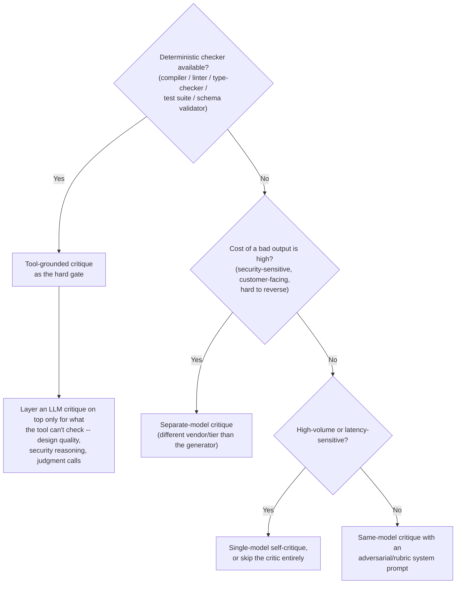

# Decision guide: which critic should you use?

"Add a critic" is not one decision -- it's a choice between four meaningfully
different mechanisms with different failure modes, and the wrong one for
your situation buys you the appearance of quality control without the
substance (see [failure_modes/01_shallow_critique](../failure_modes/01_shallow_critique)).

The cost/latency figures below are rough relative orders of magnitude, not
benchmarked numbers -- they'll depend on your models, prompt sizes, and
tooling. Treat the table as a starting point for your own measurement, not a
citation.

| Approach                                                                                                     | Catches                                                                                                             | Misses                                                                                                                               | Relative cost                         | Relative latency                                              | Determinism                                                     | Use when                                                                                                                                                                    |
| ------------------------------------------------------------------------------------------------------------ | ------------------------------------------------------------------------------------------------------------------- | ------------------------------------------------------------------------------------------------------------------------------------ | ------------------------------------- | ------------------------------------------------------------- | --------------------------------------------------------------- | --------------------------------------------------------------------------------------------------------------------------------------------------------------------------- |
| **Single-model self-critique** (same model, fresh independent call)                                          | Surface-level spec compliance, obvious omissions                                                                    | Blind spots shared with the generator -- the exact failure mode this repo opens with                                                 | $ (1 extra call)                      | + ~1 round trip                                               | Low -- stochastic, no guarantee across runs                     | Low-stakes drafts, high-volume/cost-sensitive paths, a cheap sanity pass before shipping                                                                                    |
| **Same-model, adversarial/rubric prompt**                                                                    | More than shallow self-critique -- an explicit checklist surfaces things a generic "does this work?" prompt doesn't | Still the same model's blind spots on things it fundamentally doesn't associate with risk                                            | $ (1 extra call, same model)          | + ~1 round trip                                               | Low-medium                                                      | You want cheap uplift over shallow self-critique without adding a second model or vendor to your stack                                                                      |
| **Separate-model critique** (different model/tier/vendor as critic)                                          | Blind spots decorrelated from the generator -- different training/RLHF, different failure modes                     | Still probabilistic; won't catch what neither model was trained to flag                                                              | $$ (2 models, possibly a pricier one) | + ~1 round trip (sequential -- critic needs generator output) | Low-medium -- better odds than same-model, still not guaranteed | Medium-to-high-stakes generative tasks (code review, content with reputational risk) where a second, independent perspective materially matters and budget allows it        |
| **Tool-grounded critique** (linter, compiler, type-checker, test suite, schema validator, execute-and-check) | Exactly and only what the tool checks -- and for those checks, reliably and reproducibly                            | Anything outside the tool's rules: holistic design quality, security _reasoning_, semantic correctness the tool wasn't told to check | ¢ (local compute, no LLM tokens)      | Fast -- typically sub-second, no model round trip             | **Deterministic** -- same input, same output, every time        | Any output with a formal, mechanically checkable spec: code (compiler/linter/types/tests), structured data (JSON Schema), SQL (dry-run/EXPLAIN), math (execute and compare) |

## Flowchart

## The recommended default for code generation

If your generator produces code (or anything else with a mechanical spec),
**run the tool-grounded check first, as a hard gate the output must pass
before an LLM critic ever sees it.** A linter or test suite is cheaper,
faster, and more reliable than any LLM at catching what it's designed to
catch -- spend your (slower, costlier, non-deterministic) LLM critique
budget on the things no tool can check: does this design make sense, is
there a security implication the type system can't see, does this actually
solve the user's problem. Layering an LLM critique on top of a tool-grounded
gate, rather than instead of one, is usually the right call whenever a
deterministic checker exists at all.

None of the failure-mode fixes in this repo are mutually exclusive --
combining a tool-grounded gate, a separate-model critique, a hard iteration
cap, and structural enforcement of call order is not overkill for a
high-stakes pipeline. It's overkill for a low-stakes one. Match the
mechanism to the stakes.
